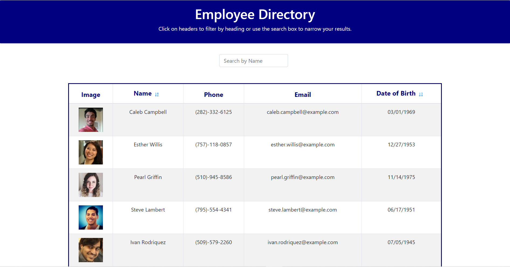
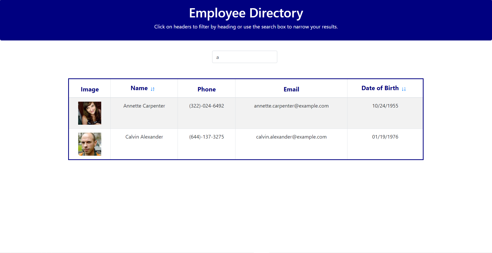
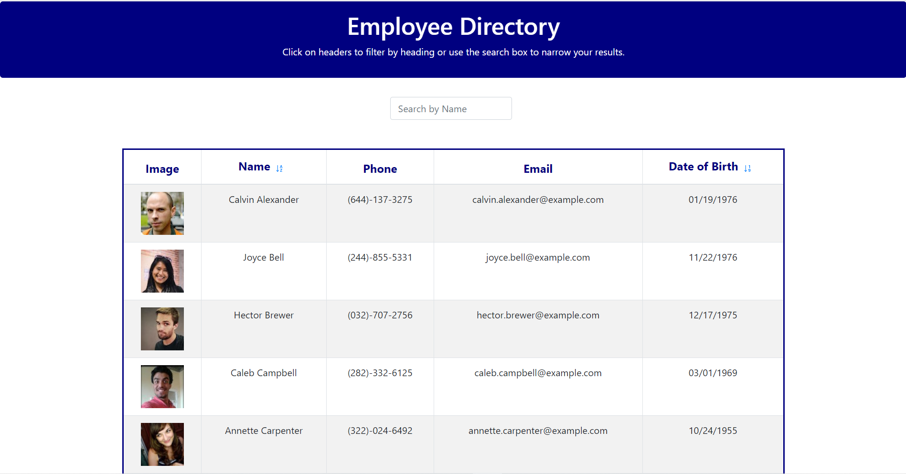
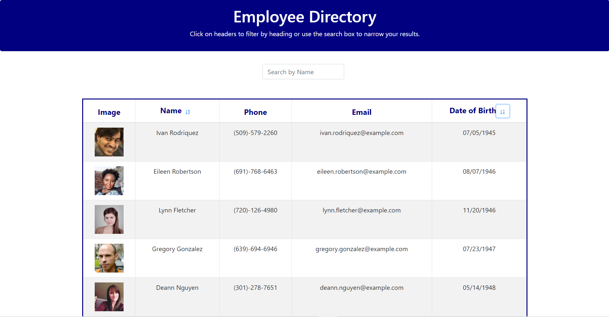

# pwa-budget-tracker

## Table of Contents
* [Description](#Description)
* [Links](#Links)
* [Usage](#Usage)
* [Design Elements](#Design-Elements)
* [App Preview](#App-Preview)
* [Credits](#Credits)

## Description
This is an app that displays a directory of employees' basic information. Users can sort the table by name or date of birth and search the table by name. Now all business owners can have quick access to all of their employees' information!

## Links
* Website: http://zachdrummond.github.io/employee-directory
* GitHub Repository: https://github.com/zachdrummond/employee-directory

## Usage
1. To find specific employees, add a name to the search bar and click the "Search" button.
2. To sort the table by name, click the "Name" header at the top of the table.
3. To sort the table by date of birth, click the "Date of Birth" header at the top of the table.

## Design Elements
* JavaScript
* React.js
* Bootstrap
* CSS
* Node Package Manager - Axios, Moment

## App Preview
### *Home Page*

### *Search Bar*

### *Sort by Name*

### *Sort by Date*

## Credits
* https://reactjs.org/
* https://react-bootstrap.github.io/
* https://www.npmjs.com/
* https://www.npmjs.com/package/moment
* https://www.npmjs.com/package/axios
* https://getbootstrap.com/